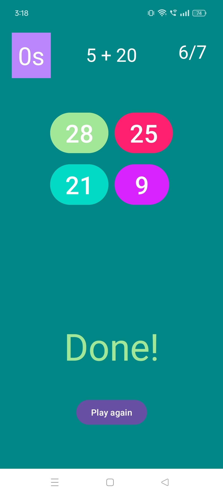
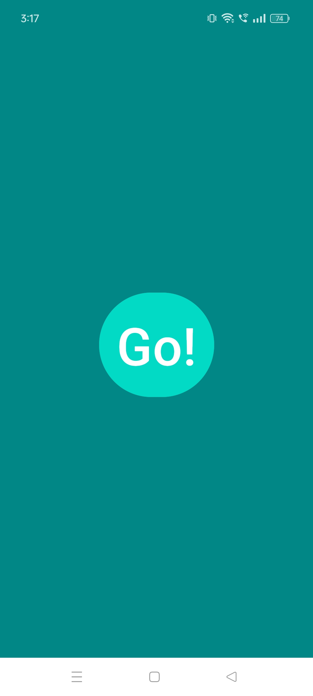
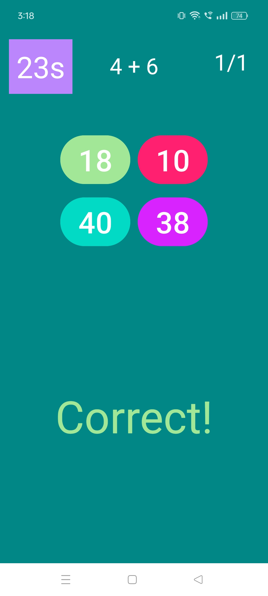

# Brain Booster Application

The Brain Booster app is designed to enhance mental agility through quick mathematical challenges. It features a countdown timer, randomized number generation, and multiple-choice questions with one correct answer. Users have 30 seconds to select the correct answer from four options.

## 📷 Screenshots

<table style="width:100%">
  <tr>
    <td style="width:50%; text-align:center;"></td>
    <td style="width:50%; text-align:center;"></td>
  </tr>
  <tr>
    <td style="width:50%; text-align:center;"></td>
    <td style="width:50%; text-align:center;"></td>
  </tr>
</table>

## Features

- Countdown Timer: Challenges users to solve as many problems as possible within 30 seconds.
- Random Number Generation: Ensures each session presents unique mathematical challenges.
- Perform addition.
- Clear and intuitive interface for basic calculations.
- Lightweight
- Multiple-Choice Questions: Tests users' ability to quickly identify the correct mathematical solution.
- Immediate Feedback: Provides instant feedback on whether the selected answer is correct.

## Technologies Used:

- Android Studio
- Language: Java
- XML
## ⚠️ Requirements

- Android 5.0 (API level 21) and above

## 📜 License

This project is licensed under the MIT License.

